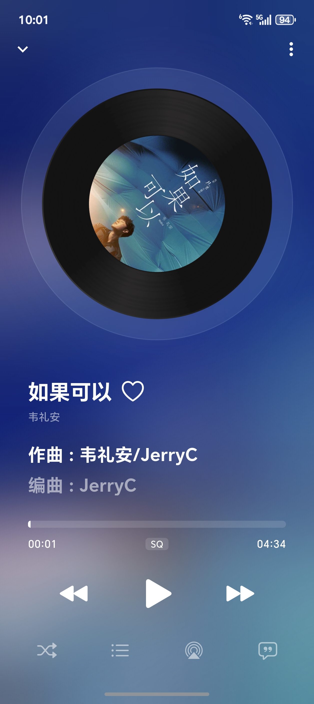
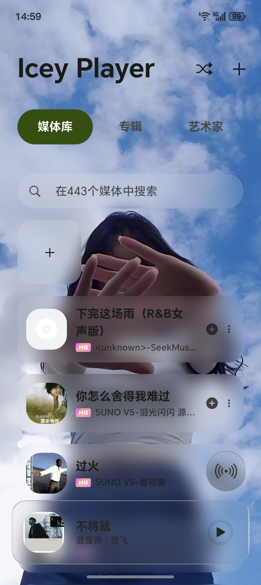
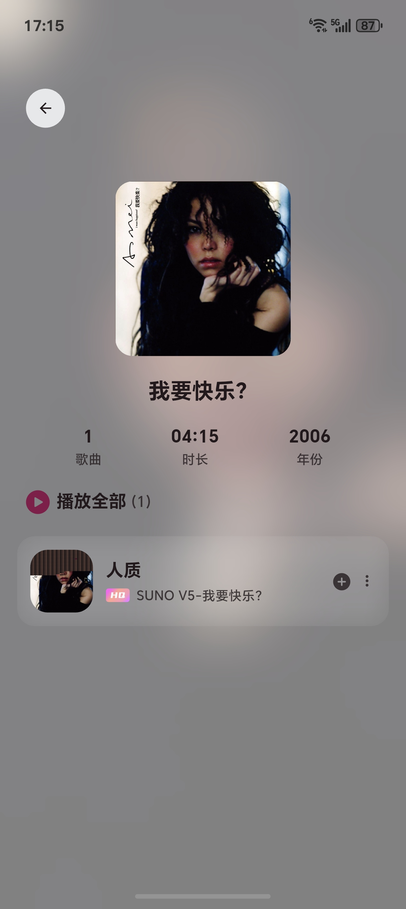
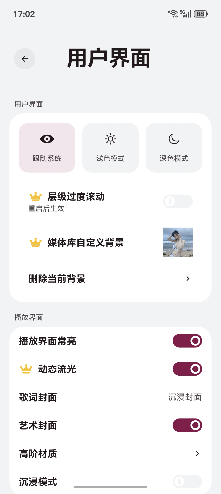
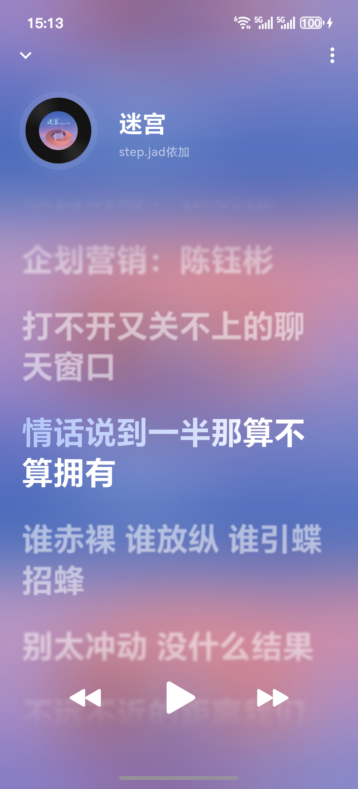
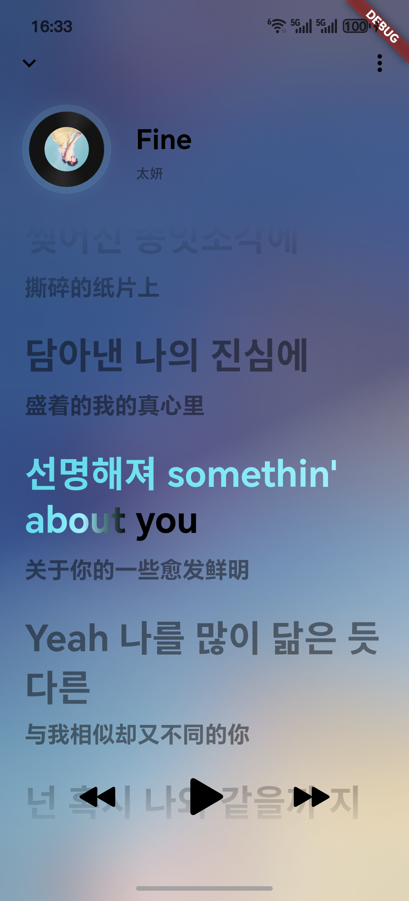

    

    <h1>Icey Player</h1>

    <!-- release version -->
    
    <!-- total download -->
    
    <!-- stars -->
    
    <!-- forks -->
    
    <!-- visitors -->
    
    <!-- license -->
    

 

使用Flutter开发的本地音乐播放器

 

## 适配平台

- [x] Android
- [ ] iOS
- [ ] Pad
- [ ] Windows
- [ ] Linux

## feat

- [x] 检索本地音乐
- [x] 读取本地音乐标签,例如歌名、艺术家以及歌词
- [x] 播放模式
- [x] 播放记忆
- [x] 封面取色
- [x] 多种播放封面
- [x] 卡拉OK歌词
- [x] 自定义界面
- [x] 演唱会模式

## 支持歌词格式

- [x] lrc
- [x] lrc逐字
- [x] ttml
- [x] qrc

 

## 下载

可以通过右侧release进行下载或拉取代码到本地进行编译

## 声明

此项目（Icey Player）是个人为了兴趣而开发,仅用于学习和测试,请于下载后24小时内删除。
项目仍有很多不完善的地方,欢迎PR一起学习提升。

感谢使用

## 致谢

- [audio_service](https://pub.dev/packages/audio_service)
- [signals](https://pub.dev/packages/signals)
- [flutter_lyric](https://pub.dev/packages/flutter_lyric)
- 等等

 
 
 

## Star History

<a href="https://www.star-history.com/#bggRGjQaUbCoE/PiliPlus&Date">
 <picture>
   <source media="(prefers-color-scheme: dark)" srcset="https://api.star-history.com/svg?repos=TroilOryan/Icey&type=Date&theme=dark" />
   <source media="(prefers-color-scheme: light)" srcset="https://api.star-history.com/svg?repos=TroilOryan/Icey&type=Date" />
   
 </picture>

 ## ✨ License

MIT License Copyright (c) 2025 TroilOryan
</a>
